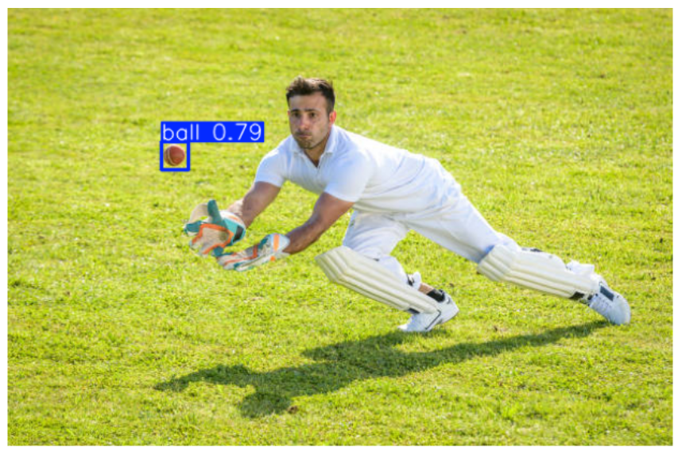
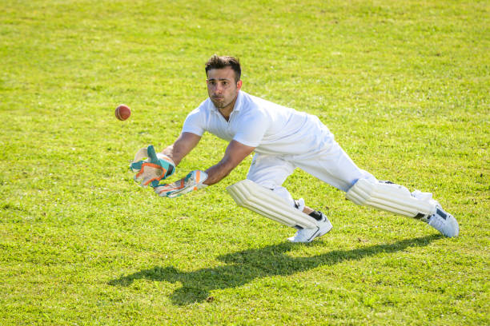

# 🏏 Cricket Ball Detection using YOLOv8  

This project implements a **YOLOv8-based object detection model** to detect cricket balls in images and videos. It includes preprocessing, training, and prediction scripts with a modular pipeline.  

---

## 📂 Project Structure  

```
cricket-ball-detection/
│
├── README.md              # Project description (this file)
├── requirements.txt       # Python dependencies
├── src/                   # Source code
│   ├── phase1_setup.py    # Environment setup & logging
│   ├── preprocess.py      # Dataset preprocessing & augmentation
│   ├── train_model.py     # YOLOv8 training pipeline
│   ├── predict.py         # Run inference on new images/videos
│   └── main.py            # End-to-end pipeline controller
├── data/                  # Dataset (YOLO format)
│   ├── train/             # Training images & labels
│   ├── valid/             # Validation images & labels
│   └── test/              # Test images & labels
```

---

## ⚙️ Installation  

Clone the repository and install dependencies:

```bash
git clone https://github.com/your-username/cricket-ball-detection.git
cd cricket-ball-detection
pip install -r requirements.txt
```

---

## 🚀 Usage  

### 1. Preprocess Dataset  
```bash
python src/preprocess.py
```

### 2. Train Model  
```bash
python src/train_model.py
```

### 3. Run Predictions  
```bash
python src/predict.py --source path/to/images_or_videos
```

### 4. End-to-End Pipeline  
```bash
python src/main.py
```

---

## 📊 Results  

- YOLOv8 was trained on a custom cricket ball dataset.  
- The model can detect cricket balls in diverse conditions.  
- Example predictions:  

| Input Image | Detection Result |
|-------------|------------------|
|  |  |

---

## 📦 Requirements  

Main dependencies (see `requirements.txt`):  
- ultralytics  
- opencv-python  
- albumentations  
- tqdm  
- matplotlib  

---

## 👨‍💻 Author  

Developed by **Muhammad Irfan** 🚀  


